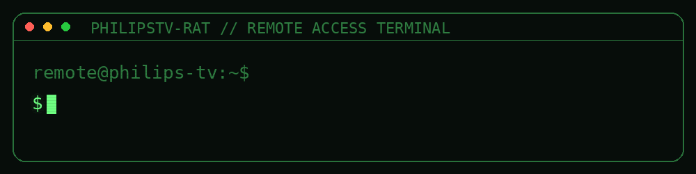

# PhilipsTV-RAT

<div align="center">
  
</div>


### Control a compatible Philips Smart TV directly from your Windows PC.

**Discover. Pair. Control. Launch apps. Switch channels. Manage Ambilight. Wake the TV.**


</div>

---

## About

**PhilipsTV-RAT** is a Windows desktop Remote Access Tool for compatible Philips Smart TVs on your **local network**.

The application is currently branded **Philips Control** in Windows. It discovers Philips TVs, connects through the Philips **JointSPACE** API, and gives you a desktop interface for controlling the TV without reaching for the physical remote.

It is built with **C#**, **.NET 10**, and **WPF**, with a compact terminal-inspired Windows 11 interface.

> [!IMPORTANT]
> Use PhilipsTV-RAT only with televisions you own or are explicitly authorized to control. The current project is designed for local-network control; it does not implement an internet-facing remote-control server or cloud relay.

## Highlights

| | Feature | What it does |
|---|---|---|
| `01` | **Automatic discovery** | Finds compatible TVs through SSDP and a fast local-subnet JointSPACE scan. |
| `02` | **JointSPACE API 1 + 6** | Supports API 6 over HTTPS/HTTP and API 1 over HTTP where available. |
| `03` | **Secure pairing flow** | Handles PIN pairing on supported newer TVs and stores credentials using Windows DPAPI. |
| `04` | **Full virtual remote** | D-pad, volume, channels, media controls, color keys, number pad, Home, Source, Info and more. |
| `05` | **Keyboard control** | Drive the TV directly from your PC keyboard with configurable shortcuts. |
| `06` | **Apps** | Load, search, launch and favorite applications reported by the TV. |
| `07` | **Live TV & sources** | Browse channels, switch channels and select inputs on supported models. |
| `08` | **Ambilight control** | Toggle Ambilight, choose follow-video/audio/color styles and apply custom colors. |
| `09` | **Power + Wake-on-LAN** | Power off through JointSPACE and wake compatible TVs using network standby/WOL. |
| `10` | **Multi-TV support** | Save multiple televisions, switch devices and reconnect to the last-used TV. |
| `11` | **Session console** | View commands, connection events, warnings and errors in one place. |
| `12` | **Windows integration** | System tray controls, start-with-Windows, single-instance behavior and saved window state. |

## Interface

The UI is organized into seven pages:

```text
Overview  →  Remote  →  Media & TV  →  Apps  →  Ambilight  →  Console  →  Settings
```

The interface includes live state cards, a selectable terminal accent color, searchable lists, pinned apps, in-app notifications and a status bar showing the active JointSPACE connection.

## Requirements

- Windows 11
- A compatible Philips Smart TV with JointSPACE/network remote control support
- PC and TV connected to the same local network
- .NET 10 Desktop Runtime when running a framework-dependent build
- Network remote control enabled in the TV settings
- Wake-on-LAN/network standby enabled on the TV if you want power-on support

> [!NOTE]
> JointSPACE capabilities vary by TV model, region and firmware. A TV may support the remote-control API while omitting apps, channels, playback metadata, Ambilight modes or wake functionality.

## Quick start

### 1. Run the application


To run from source:

```powershell
dotnet run --project PhilipsControl/PhilipsControl.csproj
```

### 2. Find your TV

On first launch, PhilipsTV-RAT scans the local network.

You can also open **Settings** and either:

- select **SCAN NETWORK**;
- enter the TV's IP address; or
- enter its hostname manually.

Discovery checks common Philips JointSPACE endpoints including:

```text
HTTPS  :1926  /6/
HTTP   :1925  /6/
HTTP   :1925  /1/
```

### 3. Pair when requested

On JointSPACE API 6 TVs, the television may display a PIN.

Enter that PIN in PhilipsTV-RAT. After successful pairing, the credentials are saved locally and protected with **Windows DPAPI**.

If the TV invalidates the credentials later, use **Settings → Pair again**.

### 4. Start controlling

Once connected, use the sidebar to open the remote, apps, media, Ambilight or settings pages.

The last-used TV is remembered and PhilipsTV-RAT automatically attempts to reconnect on startup.

## Keyboard shortcuts

When **Keyboard control** is enabled:

| Key | TV action |
|---|---|
| `↑` `↓` `←` `→` | Navigate |
| `Enter` | Confirm / OK |
| `Backspace` / `Esc` | Back |
| `H` | Home |
| `Space` | Play / Pause |
| `+` / `-` | Volume up / down |
| `M` | Mute |
| `Page Up` / `Page Down` | Channel up / down |
| `S` | Source |
| `I` | Info |
| `O` | Options |
| `A` | Ambilight on/off |
| `P` | Power |
| `0`–`9` | Number keys |
| `F5` | Refresh current TV state |
| `Ctrl` + `1` … `7` | Switch application pages |

## Remote control

The virtual remote sends JointSPACE key commands directly to the selected television.

Supported controls include:

- navigation and confirmation;
- Back and Home;
- volume and mute;
- channel stepping;
- playback controls;
- Source, Info and Options;
- color buttons;
- numeric input;
- Ambilight toggle; and
- additional model-dependent keys.

Not every key is guaranteed to be supported by every TV firmware.

## Apps

On supported TVs, PhilipsTV-RAT can retrieve the installed application list and expose it as a searchable grid.

You can:

- launch applications;
- see which reported app is currently active;
- mark favorites;
- pin favorites to the Overview page; and
- refresh the list without reconnecting.

Application availability depends entirely on what the TV exposes through JointSPACE.

## Media & live TV

The Media & TV page can expose:

- playback controls;
- current source;
- current live channel;
- searchable channel lists;
- one-click channel switching; and
- source/input selection on supported API 1 devices.

Some Philips models do not publish video titles, playback positions, channel lists or input metadata. PhilipsTV-RAT displays only the information the television provides.

## Ambilight

Compatible Ambilight televisions can expose multiple JointSPACE styles.

PhilipsTV-RAT supports categories such as:

- **Follow video** — Standard, Natural, Vivid, Game, Comfort and Relax;
- **Follow audio** — Lumina, Colora, Retro, Spectrum, Scanner, Rhythm, Flash, Strobe and Party;
- **Follow color** — Hot lava, Deep water, Fresh nature, Warm white and Cool white; and
- **Custom color** — hue, saturation and brightness controls with presets and a live preview.

Available styles are model- and firmware-dependent.

## Wake-on-LAN

When supported by the television:

1. turn on Wake-on-LAN/network standby in the TV's network settings;
2. let PhilipsTV-RAT detect the MAC address while the TV is awake, or enter it manually;
3. use **WAKE** or the power controls when the television is in compatible standby.

The app sends Wake-on-LAN packets to the available local subnets and then waits for the TV to come online before reconnecting.

Deep standby behavior varies between TV models.

## Data & privacy

Application data is stored by default in:

```text
%APPDATA%\PhilipsControl
```

Typical files include saved televisions and application settings.

For portable/testing scenarios, set:

```powershell
$env:PHILIPSCONTROL_DATA_DIR = "D:\PhilipsTV-RAT-Data"
```

before launching the application.

### Pairing credentials

JointSPACE pairing credentials are not written as plain username/password fields. They are encrypted into a credential blob through the Windows **Data Protection API (DPAPI)** before the TV record is persisted.

### Network model

PhilipsTV-RAT communicates directly between the Windows PC and the television over the LAN.

It does **not** include:

- an inbound remote-control listener;
- a web dashboard exposed to the internet;
- a cloud relay;
- account-based remote access; or
- telemetry/upload code for TV credentials.

For Philips API 6 devices, HTTPS certificate validation is intentionally relaxed because televisions commonly use device/self-signed certificates. Use the application only on networks you trust.

## Troubleshooting

<details>
<summary><b>The TV is not discovered</b></summary>

Make sure the PC and TV are on the same local network and that network remote control/JointSPACE is enabled.

Guest Wi-Fi, AP/client isolation, VLAN separation and firewall rules can block SSDP or direct access to ports `1925` and `1926`.

You can bypass discovery by entering the TV IP address manually in **Settings**.

</details>

<details>
<summary><b>The TV asks to pair again</b></summary>

The stored API 6 pairing may have expired or been invalidated by the television.

Open **Settings** and select **PAIR AGAIN**, then enter the new PIN shown on the TV.

</details>

<details>
<summary><b>Wake-on-LAN does not turn the TV on</b></summary>

Confirm that network standby/Wake-on-LAN is enabled on the television and that PhilipsTV-RAT has the correct MAC address.

Some models disable the network interface in deep standby and therefore cannot be woken through WOL.

</details>

<details>
<summary><b>Apps, channels or Ambilight options are missing</b></summary>

Those functions depend on the API capabilities exposed by the specific model and firmware.

A successful JointSPACE connection does not guarantee that every optional endpoint is available.

</details>

<details>
<summary><b>The TV is reachable but reports pairing/authentication errors</b></summary>

Try **PAIR AGAIN** first.

If the issue continues, remove and re-add the television. The session console can provide additional request and connection information.

</details>

## Build from source

Clone the repository and open the project in Visual Studio with the Windows Desktop/.NET workload installed.

Or build from PowerShell:

```powershell
dotnet restore PhilipsControl/PhilipsControl.csproj
dotnet build PhilipsControl/PhilipsControl.csproj -c Release
```

Create a Windows x64 framework-dependent publish:

```powershell
dotnet publish PhilipsControl/PhilipsControl.csproj `
  -c Release `
  -r win-x64 `
  --self-contained false
```

The application targets:

```xml
<TargetFramework>net10.0-windows</TargetFramework>
<UseWPF>true</UseWPF>
```

## Project structure

```text
.
├── PhilipsControl/
│   ├── Assets/
│   │   └── app.ico
│   ├── Models/
│   │   └── TvModels.cs
│   ├── Services/
│   │   ├── PhilipsJointSpaceClient.cs
│   │   ├── TvStore.cs
│   │   └── WakeOnLan.cs
│   ├── App.xaml
│   ├── App.xaml.cs
│   ├── MainWindow.xaml
│   ├── MainWindow.xaml.cs
│   ├── MainWindow.Features.cs
│   ├── Theme.xaml
│   ├── TrayIcon.cs
│   └── PhilipsControl.csproj
├── docs/
│   └── readme/
│       ├── banner.svg
│       ├── demo.gif
│       └── logo.png
└── README.md
```

## Architecture

```text
┌──────────────────────────┐
│     PhilipsTV-RAT UI     │
│       WPF / .NET 10      │
└────────────┬─────────────┘
             │
             ├── Discovery
             │   ├── SSDP / UPnP
             │   └── local subnet probe
             │
             ├── JointSPACE client
             │   ├── API 6 HTTPS :1926
             │   ├── API 6 HTTP  :1925
             │   └── API 1 HTTP  :1925
             │
             ├── Local state
             │   ├── settings.json
             │   ├── televisions.json
             │   └── DPAPI credential protection
             │
             └── Wake-on-LAN
                         │
                         ▼
                ┌─────────────────┐
                │ Philips Smart TV │
                └─────────────────┘
```

## Contributing

Contributions that improve TV compatibility, diagnostics, UI polish or protocol handling are welcome.

When submitting a change:

1. keep model-specific behavior defensive;
2. avoid assuming that every JointSPACE endpoint exists;
3. avoid logging pairing credentials or other secrets;
4. document any new network endpoint or permission requirement; and
5. test changes against authorized hardware only.

## Roadmap ideas

- richer device capability detection;
- optional per-TV feature flags;
- screenshot-friendly privacy mode for masking IP/MAC values;
- improved application artwork where the TV exposes icons;
- channel favorites;
- export/import for non-secret settings;
- additional diagnostics for unsupported JointSPACE endpoints; and
- signed release packaging.

## Name & trademark notice

**PhilipsTV-RAT / Philips Control is an independent community project.**

It is not affiliated with, endorsed by, sponsored by or supported by Philips or TP Vision.

“Philips” and “Ambilight” are trademarks of their respective owners.

---

<div align="center">

**PhilipsTV-RAT**

Local Philips Smart TV control from Windows.

<sub>Built around Philips JointSPACE • Use only on devices you own or are authorized to control.</sub>

</div>
